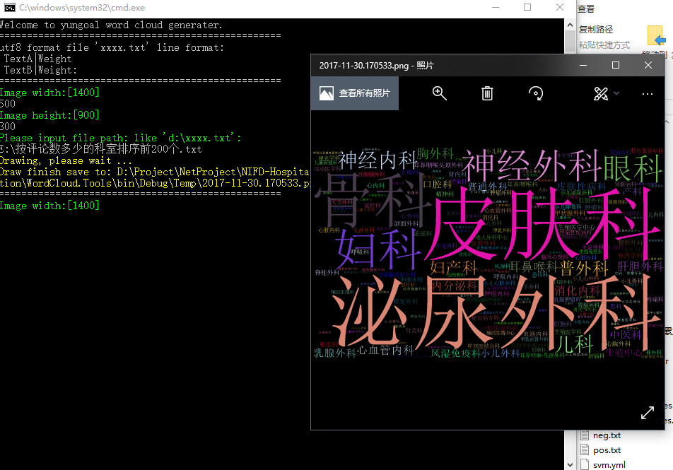

# WordCloud.Tools
A .net program that generates word clouds from text documents.


Usage:

1. Create a text document in UTF-8 format, as follows:
```
泌尿外科|2977
皮肤科|2812
骨科|2405
妇科|2366
神经外科|1972
眼科|1808
神经内科|1298
儿科|1205
普外科|1173
妇产科|1118
耳鼻喉科|1072
```

2. Use VS2017 to compile and run this project, or run the compiled EXE file directly under the directory.

